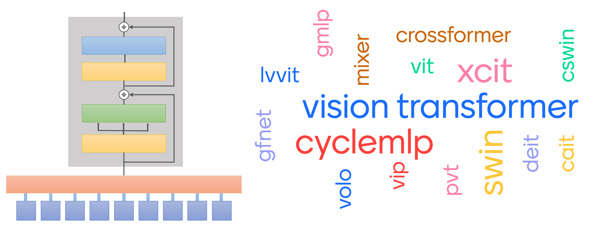

# <div align="center">SOTA Image Classification Models in PyTorch</div>

<p> <div align="center">Intended for easy to use and integrate SOTA image classification models into object detection, semantic segmentation, pose estimation, etc.</div></p>



## <div align="center">Model Zoo</div>

[efficientv2]: https://arxiv.org/abs/2104.00298
[xcit]: https://arxiv.org/abs/2106.09681
[cswin]: https://arxiv.org/abs/2107.00652v2
[volo]: https://arxiv.org/abs/2106.13112v1
[gfnet]: https://arxiv.org/abs/2107.00645
[pvtv2]: https://arxiv.org/abs/2106.13797
[longshort]: https://arxiv.org/abs/2107.02192
[shuffle]: https://arxiv.org/abs/2106.03650
[conformer]: https://arxiv.org/abs/2105.03889v1
[rest]: https://arxiv.org/abs/2105.13677v3

[micronet]: https://arxiv.org/abs/2108.05894v1
[mobileformer]: https://arxiv.org/abs/2108.05895v1

[vip]: https://arxiv.org/abs/2106.12368v1
[cyclemlp]: https://arxiv.org/abs/2107.10224

[xcitt]: https://dl.fbaipublicfiles.com/xcit/xcit_tiny_24_p16_224_dist.pth
[xcits]: https://dl.fbaipublicfiles.com/xcit/xcit_small_24_p16_224_dist.pth
[xcitm]: https://dl.fbaipublicfiles.com/xcit/xcit_medium_24_p16_224_dist.pth
[xcitl]: https://dl.fbaipublicfiles.com/xcit/xcit_large_24_p16_224_dist.pth
[cswint]: https://github.com/microsoft/CSWin-Transformer/releases/download/v0.1.0/cswin_tiny_224.pth
[cswins]: https://github.com/microsoft/CSWin-Transformer/releases/download/v0.1.0/cswin_small_224.pth
[cswinb]: https://github.com/microsoft/CSWin-Transformer/releases/download/v0.1.0/cswin_base_224.pth
[volod1]: https://github.com/sail-sg/volo/releases/download/volo_1/d1_224_84.2.pth.tar
[volod2]: https://github.com/sail-sg/volo/releases/download/volo_1/d2_224_85.2.pth.tar
[volod3]: https://github.com/sail-sg/volo/releases/download/volo_1/d3_224_85.4.pth.tar
[volod4]: https://github.com/sail-sg/volo/releases/download/volo_1/d4_224_85.7.pth.tar
[rests]: https://drive.google.com/file/d/18YGFK_ZqE_AXZ3cMLyM1Q-OnvWj0WlKZ/view?usp=sharing
[restb]: https://drive.google.com/file/d/1CdjkmikUM8tP6xKPGXXOlWdGJ9heIZqf/view?usp=sharing
[restl]: https://drive.google.com/file/d/1J60OCXwvlwbNiTwoRj-iLnGaAN9q0-g9/view?usp=sharing
[gfnett]: https://drive.google.com/file/d/1Nrq5sfHD9RklCMl6WkcVrAWI5vSVzwSm/view?usp=sharing
[gfnets]: https://drive.google.com/file/d/1w4d7o1LTBjmSkb5NKzgXBBiwdBOlwiie/view?usp=sharing
[gfnetb]: https://drive.google.com/file/d/1F900_-yPH7GFYfTt60xn4tu5a926DYL0/view?usp=sharing
[pvt1]: https://drive.google.com/file/d/1aM0KFE3f-qIpP3xfhihlULF0-NNuk1m7/view?usp=sharing
[pvt2]: https://drive.google.com/file/d/1snw4TYUCD5z4d3aaId1iBdw-yUKjRmPC/view?usp=sharing
[pvt3]: https://drive.google.com/file/d/1PzTobv3pu5R3nb3V3lF6_DVnRDBtSmmS/view?usp=sharing
[pvt4]: https://drive.google.com/file/d/1LW-0CFHulqeIxV2cai45t-FyLNKGc5l0/view?usp=sharing
[pvt5]: https://drive.google.com/file/d/1TKQIdpOFoFs9H6aApUNJKDUK95l_gWy0/view?usp=sharing
[shufflet]: https://drive.google.com/drive/folders/1goDJtcnxgBAcHhZnNwrgOlG_WBftpmOS?usp=sharing
[shuffles]: https://drive.google.com/drive/folders/1GUBBQyDldY145vDiK-BHqivmpj3K6HK2?usp=sharing
[shuffleb]: https://drive.google.com/drive/folders/1x0biaJRdN4nxLmp_3lQcA_6hO_sDBoUM?usp=sharing
[vipw]: https://drive.google.com/drive/folders/1l2XWrzqeP5n3tIm4O1jkd727j_mVoOf1?usp=sharing
[cycleb1]: https://github.com/ShoufaChen/CycleMLP/releases/download/v0.1/CycleMLP_B1.pth
[cycleb2]: https://github.com/ShoufaChen/CycleMLP/releases/download/v0.1/CycleMLP_B2.pth
[cycleb3]: https://github.com/ShoufaChen/CycleMLP/releases/download/v0.1/CycleMLP_B3.pth
[cycleb4]: https://github.com/ShoufaChen/CycleMLP/releases/download/v0.1/CycleMLP_B4.pth
[cycleb5]: https://github.com/ShoufaChen/CycleMLP/releases/download/v0.1/CycleMLP_B5.pth
[conformert]: https://drive.google.com/file/d/19SxGhKcWOR5oQSxNUWUM2MGYiaWMrF1z/view?usp=sharing
[conformers]: https://drive.google.com/file/d/1mpOlbLaVxOfEwV4-ha78j_1Ebqzj2B83/view?usp=sharing
[conformerb]: https://drive.google.com/file/d/1oeQ9LSOGKEUaYGu7WTlUGl3KDsQIi0MA/view?usp=sharing

Model | ImageNet-1k Top-1 Acc <br><sup>(%) | Params <br><sup>(M)  | GFLOPs | <sup> Variants & Weights
--- | --- | --- | --- | --- 
[EfficientNetv2][efficientv2] | 83.9`\|`85.1`\|`85.7 | 22`\|`54`\|`120 | 9`\|`24`\|`53 | S\|M\|L
||
[XCiT][xcit] | 80.4`\|`83.9`\|`84.3`\|`84.9 | 12`\|`48`\|`84`\|`189 | 2`\|`9`\|`16`\|`36 | [T][xcitt]\|[S][xcits]\|[M][xcitm]\|[L][xcitl]
[VOLO][volo] | 84.2`\|`85.2`\|`85.4`\|`85.7 | 27`\|`59`\|`86`\|`193 | 7`\|`14`\|`21`\|`44 | [D1][volod1]\|[D2][volod2]\|[D3][volod3]\|[D4][volod4]
||
[MicroNet][micronet] | 51.4`\|`59.4`\|`62.5 | 1`\|`2`\|`3 | 0.006`\|`0.01`\|`0.02 | M1\|M2\|M3
[MobileFormer][mobileformer] | 64.0`\|`68.7`\|`72.8`\|`76.7`\|`77.9`\|`79.3 | 3`\|`4`\|`5`\|`9`\|`11`\|`14 | 0.03`\|`0.05`\|`0.1`\|`0.2`\|`0.3`\|`0.5 | 26\|52\|96\|214\|294\|508
||
[PVTv2][pvtv2] | 78.7`\|`82.0`\|`83.1`\|`83.6`\|`83.8 | 14`\|`25`\|`45`\|`63`\|`82 | 2`\|`4`\|`7`\|`10`\|`12 | [B1][pvt1]\|[B2][pvt2]\|[B3][pvt3]\|[B4][pvt4]\|[B5][pvt5]
[GFNet][gfnet] | 80.1`\|`81.5`\|`82.9 | 15`\|`32`\|`54 | 2`\|`5`\|`8 | [T][gfnett]\|[S][gfnets]\|[B][gfnetb]
[ResT][rest] | 79.6`\|`81.6`\|`83.6 | 14`\|`30`\|`52 | 2`\|`4`\|`8 | [S][rests]\|[B][restb]\|[L][restl]
||
[Conformer][conformer] | 81.3`\|`83.4`\|`84.1 | 24`\|`38`\|`83 | 5`\|`11`\|`23 | [T][conformert]\|[S][conformers]\|[B][conformerb]
[Shuffle][shuffle] | 82.4`\|`83.6`\|`84.0 | 28`\|`50`\|`88 | 5`\|`9`\|`16 | [T][shufflet]\|[S][shuffles]\|[B][shuffleb]
[CSWin][cswin] | 82.7`\|`83.6`\|`84.2 | 23`\|`35`\|`78 | 4`\|`7`\|`15 | [T][cswint]\|[S][cswins]\|[B][cswinb]
[ViL-LS][longshort] | 83.8`\|`84.1 | 40`\|`56 | 9`\|`13 | M\|B
||
[ViP][vip] | 81.5`\|`82.7`\|`83.2 | 25`\|`55`\|`88 | 7`\|`16`\|`24 | [S][vipw]\|[M][vipw]\|[L][vipw]
[CycleMLP][cyclemlp] | 78.9`\|`81.6`\|`82.4`\|`83.0`\|`83.2 | 15`\|`27`\|`38`\|`52`\|`76 | 2`\|`4`\|`7`\|`10`\|`12 | [B1][cycleb1]\|[B2][cycleb2]\|[B3][cycleb3]\|[B4][cycleb4]\|[B5][cycleb5]

<details open>
  <summary><strong>Table Notes</strong></summary>

* Image size is 224x224. EfficientNetv2 uses progressive learning (image size from 128 to 380).
* All models' weights are from official repositories.
* Only models trained on ImageNet1k are compared. 
* (Parameters > 200M) Models are not included. 
* *PVTv2*, *ResT*, *Conformer*, *XCiT* and *CycleMLP* models work with any image size.

</details>


## <div align="center">Usage</div>

<details>
  <summary><strong>Requirements</strong> (click to expand)</summary>

* python >= 3.6
* torch >= 1.8.1
* torchvision >= 0.9.1

Other requirements can be installed with `pip install -r requirements.txt`.

</details>

<br>
<details open>
  <summary><strong>Show Available Models</strong></summary>

```bash
$ python tools/show.py
```

A nice table with model names and variants will be shown:

```
Model Names    Model Variants
-------------  --------------------------------
resnet         ['18', '34', '50', '101', '152']
xcit           ['T', 'S', 'M', 'L']
cswin          ['T', 'S', 'B', 'L']
volo           ['D1', 'D2', 'D3', 'D4']
gfnet          ['T', 'S', 'B']
pvtv2          ['B1', 'B2', 'B3', 'B4', 'B5']
shuffle        ['T', 'S', 'B']
rest           ['S', 'B', 'L']
conformer      ['T', 'S', 'B']
vip            ['S', 'M', 'L']
cyclemlp       ['B1', 'B2', 'B3', 'B4', 'B5']
```

</details>

<details open>
  <summary><strong>Inference</strong></summary>

* Download your desired model's weights from `Model Zoo` table.
* Change `MODEL` parameters and `TEST` parameters in config file [here](./configs/test.yaml). And run the the following command.

```bash
$ python tools/infer.py --cfg configs/test.yaml
```

You will see an output similar to this:

```
File: assests\dog.jpg >>>>> Golden retriever
```
</details>

<br>
<details>
  <summary><strong>Citations</strong> (click to expand)</summary>

```
@article{zhql2021ResT,
  title={ResT: An Efficient Transformer for Visual Recognition},
  author={Zhang, Qinglong and Yang, Yubin},
  journal={arXiv preprint arXiv:2105.13677v3},
  year={2021}
}

@article{peng2021conformer,
  title={Conformer: Local Features Coupling Global Representations for Visual Recognition}, 
  author={Zhiliang Peng and Wei Huang and Shanzhi Gu and Lingxi Xie and Yaowei Wang and Jianbin Jiao and Qixiang Ye},
  journal={arXiv preprint arXiv:2105.03889},
  year={2021},
}

@misc{dong2021cswin,
  title={CSWin Transformer: A General Vision Transformer Backbone with Cross-Shaped Windows}, 
  author={Xiaoyi Dong and Jianmin Bao and Dongdong Chen and Weiming Zhang and Nenghai Yu and Lu Yuan and Dong Chen and Baining Guo},
  year={2021},
  eprint={2107.00652},
  archivePrefix={arXiv},
  primaryClass={cs.CV}
}

@misc{chen2021cyclemlp,
  title={CycleMLP: A MLP-like Architecture for Dense Prediction}, 
  author={Shoufa Chen and Enze Xie and Chongjian Ge and Ding Liang and Ping Luo},
  year={2021},
  eprint={2107.10224},
  archivePrefix={arXiv},
  primaryClass={cs.CV}
}

@misc{wang2021pvtv2,
  title={PVTv2: Improved Baselines with Pyramid Vision Transformer}, 
  author={Wenhai Wang and Enze Xie and Xiang Li and Deng-Ping Fan and Kaitao Song and Ding Liang and Tong Lu and Ping Luo and Ling Shao},
  year={2021},
  eprint={2106.13797},
  archivePrefix={arXiv},
  primaryClass={cs.CV}
}

@misc{elnouby2021xcit,
  title={XCiT: Cross-Covariance Image Transformers}, 
  author={Alaaeldin El-Nouby and Hugo Touvron and Mathilde Caron and Piotr Bojanowski and Matthijs Douze and Armand Joulin and Ivan Laptev and Natalia Neverova and Gabriel Synnaeve and Jakob Verbeek and Hervé Jegou},
  year={2021},
  eprint={2106.09681},
  archivePrefix={arXiv},
  primaryClass={cs.CV}
}

@misc{yuan2021volo,
  title={VOLO: Vision Outlooker for Visual Recognition}, 
  author={Li Yuan and Qibin Hou and Zihang Jiang and Jiashi Feng and Shuicheng Yan},
  year={2021},
  eprint={2106.13112},
  archivePrefix={arXiv},
  primaryClass={cs.CV}
}

@misc{yan2020micronet,
  title={MicroNet for Efficient Language Modeling}, 
  author={Zhongxia Yan and Hanrui Wang and Demi Guo and Song Han},
  year={2020},
  eprint={2005.07877},
  archivePrefix={arXiv},
  primaryClass={cs.CL}
}

@misc{chen2021mobileformer,
  title={Mobile-Former: Bridging MobileNet and Transformer}, 
  author={Yinpeng Chen and Xiyang Dai and Dongdong Chen and Mengchen Liu and Xiaoyi Dong and Lu Yuan and Zicheng Liu},
  year={2021},
  eprint={2108.05895},
  archivePrefix={arXiv},
  primaryClass={cs.CV}
}

@article{rao2021global,
  title={Global Filter Networks for Image Classification},
  author={Rao, Yongming and Zhao, Wenliang and Zhu, Zheng and Lu, Jiwen and Zhou, Jie},
  journal={arXiv preprint arXiv:2107.00645},
  year={2021}
}

@article{huang2021shuffle,
  title={Shuffle Transformer: Rethinking Spatial Shuffle for Vision Transformer},
  author={Huang, Zilong and Ben, Youcheng and Luo, Guozhong and Cheng, Pei and Yu, Gang and Fu, Bin},
  journal={arXiv preprint arXiv:2106.03650},
  year={2021}
}

@misc{zhu2021longshort,
  title={Long-Short Transformer: Efficient Transformers for Language and Vision}, 
  author={Chen Zhu and Wei Ping and Chaowei Xiao and Mohammad Shoeybi and Tom Goldstein and Anima Anandkumar and Bryan Catanzaro},
  year={2021},
  eprint={2107.02192},
  archivePrefix={arXiv},
  primaryClass={cs.CV}
}

@misc{hou2021vision,
  title={Vision Permutator: A Permutable MLP-Like Architecture for Visual Recognition},
  author={Qibin Hou and Zihang Jiang and Li Yuan and Ming-Ming Cheng and Shuicheng Yan and Jiashi Feng},
  year={2021},
  eprint={2106.12368},
  archivePrefix={arXiv},
  primaryClass={cs.CV}
}


```

</details>