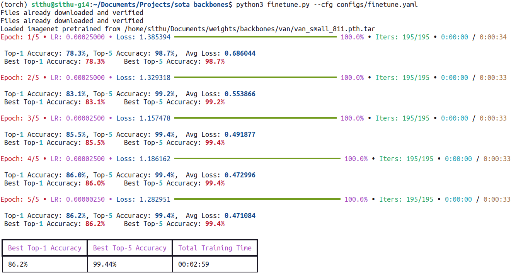

# <div align="center">SOTA Image Classification Models in PyTorch</div>

<div align="center">
<p>Intended for easy to use and integrate SOTA image classification models into down-stream tasks and finetuning with custom datasets</p>

<a href="https://colab.research.google.com/github/sithu31296/image-classification/blob/main/tutorial.ipynb"></a>

</div>


## <div align="center">Features</div>

* Applicable for the following tasks: 
  * **Fine-tuning** with custom classification datasets.
  * Used **as a backbone** in downstream tasks like object detection, semantic segmentation, pose estimation, etc.
* Almost **no dependency** in model usage.
* 10+ High-precision and High-efficient **SOTA models**.
* **Regularly updated** with new models.
* PyTorch, ONNX, CoreML, TFLite, OpenVINO Inference and Export.

## <div align="center">Supported Models</div>

2021
* [ResT](https://arxiv.org/abs/2105.13677v3) (NeurIPS 2021) (wofmanaf)
* [MicroNet](https://arxiv.org/abs/2108.05894v1) (ICCV 2021) (Yunsheng Li)
* [ResNet*](https://arxiv.org/abs/2110.00476) (ArXiv 2021) (Ross Wightman)
* [PatchConvnet](https://arxiv.org/abs/2112.13692) (ArXiv 2021) (Meta Research)

2022
* [CSWin](https://arxiv.org/abs/2107.00652v2) (CVPR 2022) (Microsoft)
* [PVTv2](https://arxiv.org/abs/2106.13797) (CVMJ 2022) (whai362)
* [UniFormer](https://arxiv.org/abs/2201.09450) (ICLR 2022) (SenseTime X-Lab)
* [PoolFormer](https://arxiv.org/abs/2111.11418) (CVPR 2022) (Sea AI Lab)
* [ConvNeXt](https://arxiv.org/abs/2201.03545) (CVPR 2022) (Meta Research)
* [VAN](https://arxiv.org/abs/2202.09741) (ArXiv 2022) (BNRist)
* [FocalNet](https://arxiv.org/abs/2203.11926) (ArXiv 2022) (Microsoft)
* [WaveMLP](https://arxiv.org/abs/2111.12294) (CVPR 2022) (HUAWEI Noah's Ark Lab)
* [DaViT](https://arxiv.org/abs/2204.03645) (ArXiv 2022) (dingmyu)
* [NAT](https://arxiv.org/abs/2204.07143) (ArXiv 2022) (SHI Lab)
* [FAN](https://arxiv.org/abs/2204.12451) (ArXiv 2022) (NVlabs)
* [ResTv2](https://arxiv.org/abs/2204.07366v1) (ArXiv 2022) (wofmanaf)

Losses
* [PolyLoss](https://arxiv.org/abs/2204.12511v1) (ICLR 2022) (yiyixuxu)

## <div align="center">Benchmarks</div>

Model | ImageNet-1k Top-1 Acc <br><sup>(%) | Params <br><sup>(M)  | GFLOPs | Variants & Weights
--- | --- | --- | --- | --- 
MicroNet | 51.4`\|`59.4`\|`62.5 | 2`\|`2`\|`3 | 7M`\|`14M`\|`23M | [M1][micronetw]\|[M2][micronetw]\|[M3][micronetw]
||
ResNet* | 71.5`\|`80.4`\|`81.5 | 12`\|`26`\|`45 | 2`\|`4`\|`8 | [18][rsb18]\|[50][rsb50]\|[101][rsb101]
PoolFormer | 80.3`\|`81.4`\|`82.1 | 21`\|`31`\|`56 | 4`\|`5`\|`9 | [S24][pfs24]\|[S36][pfs36]\|[M36][pfm36]
WaveMLP | 80.9`\|`82.9`\|`83.3 | 17`\|`30`\|`44 | 2`\|`5`\|`8 | [T][wavet]\|[S][waves]\|[M][wavem]
PVTv2 | 78.7`\|`82.0`\|`83.6 | 14`\|`25`\|`63 | 2`\|`4`\|`10 | [B1][pvt1]\|[B2][pvt2]\|[B4][pvt4]
ResT | 79.6`\|`81.6`\|`83.6 | 14`\|`30`\|`52 | 2`\|`4`\|`8 | [S][rests]\|[B][restb]\|[L][restl]
UniFormer | -NA`\|`82.9`\|`83.8 | --`\|`22`\|`50 | -`\|`4`\|`8 | -\|[S][uniformers]\|[B][uniformerb]
VAN | 75.4`\|`81.1`\|`82.8`\|`83.9 | 4`\|`14`\|`27`\|`45 | 1`\|`3`\|`5`\|`9 | T\|[S][vans]\|[B][vanb]\|[L][vanl]
ResTv2 | 82.3`\|`83.2`\|`83.7`\|`84.2 | 30`\|`41`\|`56`\|`87 | 4`\|`6`\|`8`\|`14 | T\|S\|B\|L
FAN | 80.1`\|`83.5`\|`83.9`\|`84.3 | 7`\|`26`\|`50`\|`77 | 4`\|`7`\|`11`\|`17 | T\|S\|B\|L
||
PatchConvnet | 82.1`\|`83.2`\|`83.5 | 25`\|`48`\|`99 | 4`\|`8`\|`16 | [S60][pcs60]\|[S120][pcs120]\|[B60][pcb60]
ConvNeXt | 82.1`\|`83.1`\|`83.8 | 28`\|`50`\|`89 | 5`\|`9`\|`15 | [T][convnextt]\|[S][convnexts]\|[B][convnextb]
FocalNet | 82.3`\|`83.5`\|`83.9 | 29`\|`50`\|`89 | 5`\|`9`\|`15 | [T][focalt]\|[S][focals]\|[B][focalb]
CSWin | 82.7`\|`83.6`\|`84.2 | 23`\|`35`\|`78 | 4`\|`7`\|`15 | [T][cswint]\|[S][cswins]\|[B][cswinb]
NAT | 81.8`\|`83.2`\|`83.7`\|`84.3 | 20`\|`28`\|`51`\|`90 | 3\`\|`4`\|`8`\|`14 | M\|T\|S\|B
DaViT | 82.8`\|`84.2`\|`84.6 | 28`\|`50`\|`88 | 5`\|`9`\|`16 | T\|S\|B

> Notes: ResNet* is from "ResNet strikes back" paper.

<details open>
  <summary><strong>Table Notes</strong></summary>

* Only include models trained on ImageNet1k with image size of 224x224 without additional tricks like token labeling, self-supervised learning, etc.
* Models' weights are from respective official repositories.
* Large mdoels (Parameters > 100M) are not included. 

</details>


## <div align="center">Usage</div>

### <div align="center">Requirements</div>

* torch >= 1.11
* torchvision >= 0.12

Other requirements can be installed with `pip install -r requirements.txt`.

</details>

### <div align="center">Show Supported Models</div>

```bash
$ python list_models.py
```

A table with model names and variants will be shown:

```
                Supported Models
               
  Model Names  │ Model Variants
╶──────────────┼──────────────────────────────────╴
  ResNet       │ ['18', '34', '50', '101', '152']
  MicroNet     │ ['M1', 'M2', 'M3']
  ConvNeXt     │ ['T', 'S', 'B']
  VAN          │ ['S', 'B', 'L']
  PVTv2        │ ['B1', 'B2', 'B3', 'B4', 'B5']
  ResT         │ ['S', 'B', 'L']
  CSWin        │ ['T', 'S', 'B', 'L']
  WaveMLP      │ ['T', 'S', 'M']
  PoolFormer   │ ['S24', 'S36', 'M36']
  PatchConvnet │ ['S60', 'S120', 'B60']
  UniFormer    │ ['S', 'B']
  FocalNet     │ ['T', 'S', 'B']
```

### <div align="center">Inference</div>

```bash
# Example with VAN-S
$ python infer.py --source assests/dog.jpg --model VAN --variant S --checkpoint /path/to/van_s
```

You will see an output similar to this:

```
assests\dog.jpg >>>>> Golden retriever
```

>> Note: The above code is only for ImageNet pre-trained models. Modify the model's checkpoint loading and class names in `infer.py` for your custom needs.

### <div align="center">Finetune</div>

You can use any dataset from [torchvision.datasets](https://pytorch.org/vision/stable/datasets.html#image-classification). For custom datasets, [ImageFolder](https://pytorch.org/vision/stable/generated/torchvision.datasets.ImageFolder.html#torchvision.datasets.ImageFolder) can be used to create a dataset class.

In this repo, finetuning on CIFAR-10 is provided in `finetune.py`.

!! What is not available yet:
* Distributed training
* Mixup and Cutmix augmentation

```bash
$ python finetune.py --cfg configs/finetune.yaml
```



</details>

### <div align="center">Convert to other Frameworks</div>

Install respective libraries for your desire framework:

```bash
# ONNX
$ pip install onnx onnx-simplifier onnxruntime
# CoreML
$ pip install coremltools
# OpenVINO
$ pip install onnx onnx-simplifier openvino-dev 
# TFLite (Coming Soon)
$ pip install onnx onnx-simplifier openvino-dev openvino2tensorflow tflite-runtime
```

Convert:

```bash
# ONNX
$ python convert/to_onnx.py --model MODEL_NAME --variant MODEL_VARIANT --num_classes NUM_CLASSES --checkpoint /path/to/weights --size IMAGE_SIZE

# CoreML
$ python convert/to_coreml.py --model MODEL_NAME --variant MODEL_VARIANT --num_classes NUM_CLASSES --checkpoint /path/to/weights --size IMAGE_SIZE

# OpenVINO
$ python convert/to_openvino.py --model MODEL_NAME --variant MODEL_VARIANT --num_classes NUM_CLASSES --checkpoint /path/to/weights --size IMAGE_SIZE --precision FP32 or FP16
```

Inference:

```bash
# PyTorch
$ python convert/infer_pt.py --source IMG_FILE_PATH --model MODEL_NAME --variant MODEL_VARIANT --num_classes NUM_CLASSES --checkpoint /path/to/weights --size IMAGE_SIZE --device cuda or cpu

# ONNX
$ python convert/infer_onnx.py --source IMG_FILE_PATH --model MODEL_PATH

# OpenVINO
$ python convert/infer_openvino.py --source IMG_FILE_PATH --model MODEL_PATH --device CPU or GPU
```

### <div align="center">Framework Comparison</div>

CPU:

Model | PyTorch | ONNX | OpenVINO | TFLite
--- | --- | --- | --- | ---
VAN-S | 46 | 28 | - | -

GPU:

Model | PyTorch (FP32) | TensorRT (FP32) 
--- | --- | --- 
VAN-S | 6 | -

>> Latency in milliseconds. Tested with Ryzen 7 4800HS and RTX 1650ti.

## <div align="center">Acknowledgements</div>

Most of the codes are borrowed from [timm](https://github.com/rwightman/pytorch-image-models) and [DeiT](https://github.com/facebookresearch/deit). I would like to thank the papers' authors for open-sourcing their codes and providing pre-trained models.


[cswint]: https://github.com/microsoft/CSWin-Transformer/releases/download/v0.1.0/cswin_tiny_224.pth
[cswins]: https://github.com/microsoft/CSWin-Transformer/releases/download/v0.1.0/cswin_small_224.pth
[cswinb]: https://github.com/microsoft/CSWin-Transformer/releases/download/v0.1.0/cswin_base_224.pth
[rests]: https://drive.google.com/file/d/18YGFK_ZqE_AXZ3cMLyM1Q-OnvWj0WlKZ/view?usp=sharing
[restb]: https://drive.google.com/file/d/1CdjkmikUM8tP6xKPGXXOlWdGJ9heIZqf/view?usp=sharing
[restl]: https://drive.google.com/file/d/1J60OCXwvlwbNiTwoRj-iLnGaAN9q0-g9/view?usp=sharing
[pvt1]: https://drive.google.com/file/d/1aM0KFE3f-qIpP3xfhihlULF0-NNuk1m7/view?usp=sharing
[pvt2]: https://drive.google.com/file/d/1snw4TYUCD5z4d3aaId1iBdw-yUKjRmPC/view?usp=sharing
[pvt4]: https://drive.google.com/file/d/1LW-0CFHulqeIxV2cai45t-FyLNKGc5l0/view?usp=sharing
[micronetw]: https://drive.google.com/drive/folders/1j4JSTcAh94U2k-7jCl_3nwbNi0eduM2P?usp=sharing
[pfs24]: https://github.com/sail-sg/poolformer/releases/download/v1.0/poolformer_s24.pth.tar
[pfs36]: https://github.com/sail-sg/poolformer/releases/download/v1.0/poolformer_s36.pth.tar
[pfm36]: https://github.com/sail-sg/poolformer/releases/download/v1.0/poolformer_m36.pth.tar
[rsb18]: https://github.com/rwightman/pytorch-image-models/releases/download/v0.1-rsb-weights/resnet18_a1_0-d63eafa0.pth
[rsb50]: https://github.com/rwightman/pytorch-image-models/releases/download/v0.1-rsb-weights/resnet50_a1_0-14fe96d1.pth
[rsb101]: https://github.com/rwightman/pytorch-image-models/releases/download/v0.1-rsb-weights/resnet101_a1_0-cdcb52a9.pth
[pcs60]: https://dl.fbaipublicfiles.com/deit/s60_224_1k.pth
[pcs120]: https://dl.fbaipublicfiles.com/deit/s120_224_1k.pth
[pcb60]: https://dl.fbaipublicfiles.com/deit/b60_224_1k.pth
[convnextt]: https://dl.fbaipublicfiles.com/convnext/convnext_tiny_1k_224_ema.pth
[convnexts]: https://dl.fbaipublicfiles.com/convnext/convnext_small_1k_224_ema.pth
[convnextb]: https://dl.fbaipublicfiles.com/convnext/convnext_base_1k_224_ema.pth
[uniformers]: https://drive.google.com/file/d/1-uepH3Q3BhTmWU6HK-sGAGQC_MpfIiPD/view?usp=sharing
[uniformerb]: https://drive.google.com/file/d/1-wT39QazTGELxgrQIu6J12D3qcla3hui/view?usp=sharing
[wavet]: https://drive.google.com/file/d/1UHttXxHHGgy8ugwbfPqtxLyKIexLU4Q5/view?usp=sharing
[waves]: https://drive.google.com/file/d/17yaTAixP_j5Xu7B46P2_altAO8UhuEDw/view?usp=sharing
[wavem]: https://drive.google.com/file/d/1O8AbNRuVKsqbQ9lChYaz981AwVzkw-CR/view?usp=sharing
[vans]: https://drive.google.com/file/d/1LFsJHwxAs1TcXAjJ28G86_jwYwV8DzuG/view?usp=sharing
[vanb]: https://drive.google.com/file/d/1qApsgXCbngNYOji2UzJsfeEsPOu6dBo3/view?usp=sharing
[vanl]: https://drive.google.com/file/d/10n6u-W3IrqiCD-7wkotejV_1XiS9kuWF/view?usp=sharing
[focalt]: https://projects4jw.blob.core.windows.net/focalnet/release/classification/focalnet_tiny_lrf.pth
[focals]: https://projects4jw.blob.core.windows.net/focalnet/release/classification/focalnet_small_lrf.pth
[focalb]: https://projects4jw.blob.core.windows.net/focalnet/release/classification/focalnet_base_lrf.pth